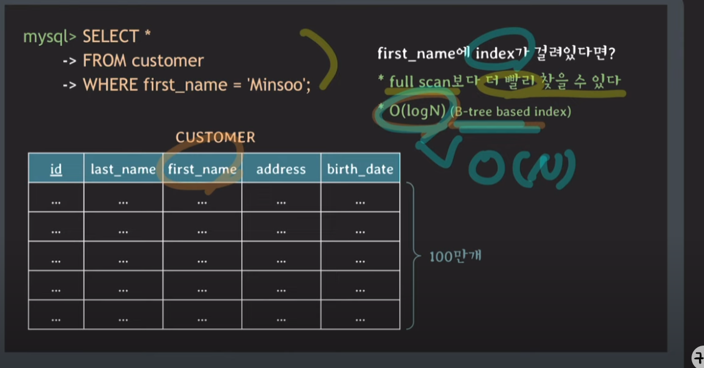

#인덱스가 무엇인지

 해당 컬럼이 인덱스가 걸려있지 않으면 테이블을 풀스캔하여 O(n)으로 찾게 원하는 값을 찾는데 시간이 매우 걸린다

 해당 컬럼이 인덱스가 걸려있는 경우 b tree로 해당컬럼에 데이터를 찾아 시간복잡도가 O(logN)b-tree bases index 이므로 매우빠르게 해당 컬럼을 찾을수있게된다.

 인덱스를 사용하는 이유는 조건을 만족하는 튜플(로우)들을 빠르게 조회하기 위해서 사용을 한다.

