# db index로 b btree 계열이 사용된는가?

	avg case	 worst case

조회	o(logn)

삽입	o(logn)

삭제	o(logn)

cpu -> main memory(ram) -> secondary storage (ssd or hdd)

-----------------------------------------------------

# cpu

cpu 코드를 실행하고 처리하는곳

# main memory(ram)

실행중인 코드들과 코드들과 관련된 데이터들이 상주하는곳 휘발성 데이터
단 메인 메모리가 용량이 작아서 사용하는 프로그램에 데이터가 양이 많으면 메인메모리에 다담지 못해서 
자주 사용하지 데이터들은 secondary storage에 임시로 저장한다(이걸 스왑이라고 한다);
나중에 스왑한 데이터가 필요하면 다시 메모리에 올려서 사용를 한다.

# secondary storage(hdd or ssd)
 
영구이 데이터들이 저장되는곳,
실행중인 프로그램의 데이터가 일부가 임시로 저장되는곳
특징 1. 데이터를 처리하는 속도가 가장느리다

예시)

기억장치 	평균 속도

ram			40 ~ 50GB/s

SSD			3 ~ 5GB/s

HDD			02 ~ 03 GB/secondary

 ** ddr5 64bit bus
 ** m.2 nvme sequentital /read/write

 특징 2. 데이터를 저장하는 용량이 가장크다.

 특징 3. block 단위로 데이터를 읽고 쓴다

 block 이란
 block: file system이 데이터를 읽고 쓰는 논리적인 단위
 block의 크기는 2의 승수로 표현되면 대표적인 block size는 4kb ,8kb,16kb등이 있다.
 예시 메모리에서 hdd에 데이터를 가져올떄 해당 데이터가 포함되고있는 block 전체를 뽑아 메모리에 상주시킨다.

block 방식이 장단점

단점: 불필요한 데이터까지 읽어올 가능성이 있다.

----------------------

# database

### 1. db는 secondary storage에 저장이된다.

	- 예) 데이터를 가져오는 방식이

	cpu에서 해당 쿼리를 실행할떄 메인메모리에서 해당데이터들이 전부포함되있으면 메인 메모리에서 바로가져와 사용하고
	메인메모리에 조회할 데이터가 없는경우에는 secondary storage에 block단위로 데이터를 메인메모리에 상주시키고 
	메인메모리에서 cpu로 데이터를 다시 전달한다.

### 2. db에서 데이터를 조회할떄 secondary storage에 최대한 적게 접근하는것이 성능면에서는 좋다.

### 3.block 단위로 읽고 쓰기때문에 연관데이터를 모아서 저장하면 더 효율적으로 읽고 쓸수 있다.

# index를 b tree로 사용하는중인이유

### avl tree index(b) vs btree index b

## 제약 사항

tree 각노드는 서로 다른 block 에 있다고 가정

초기에는 root 노드를 제외한 모든 노드는 secondary storage에 있다고 가정

초기에 데이터 자체도 모둔 secondary storage에 있다고 가정

# 데이터
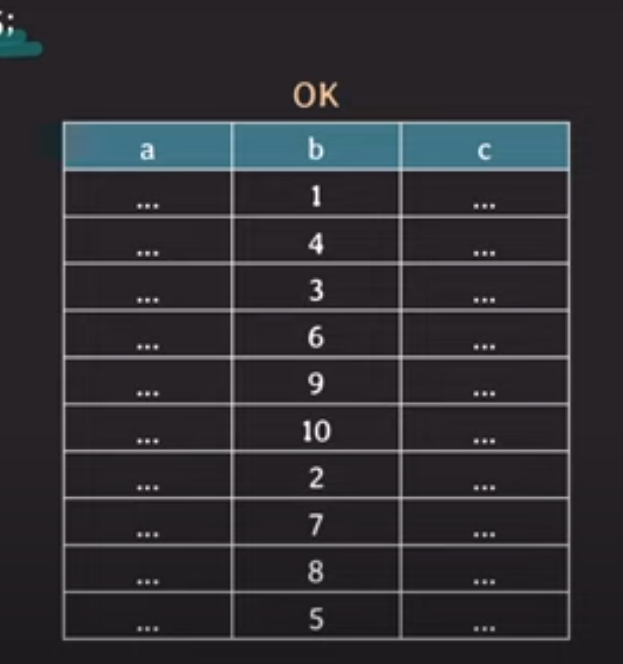

# avg tree 구조 및 데이터를 찾는 방법

### where b = 5;

### 1. 
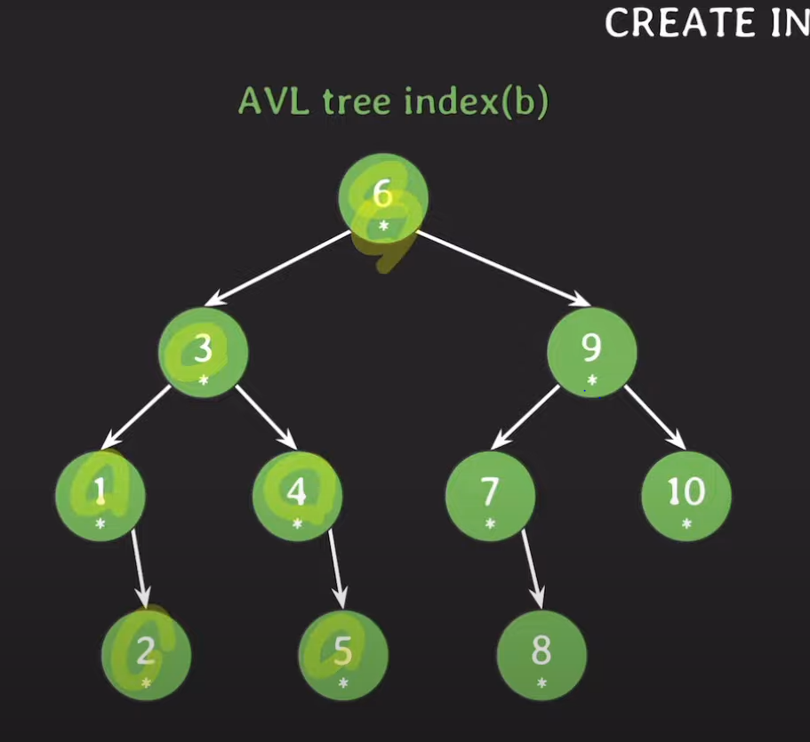

### 2. 

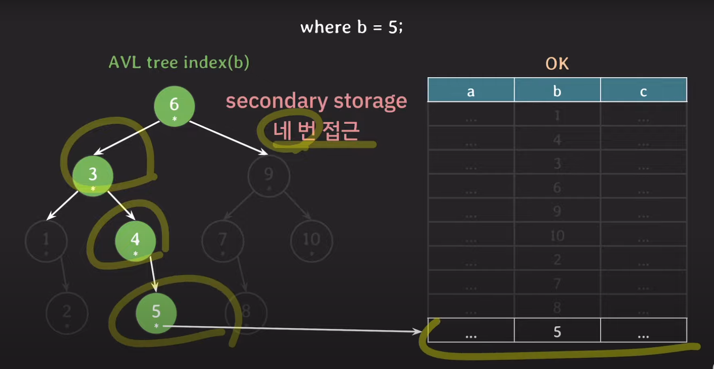

 
  

# 5차 btree index(b) 구조 및 데이트를 찾는 방법

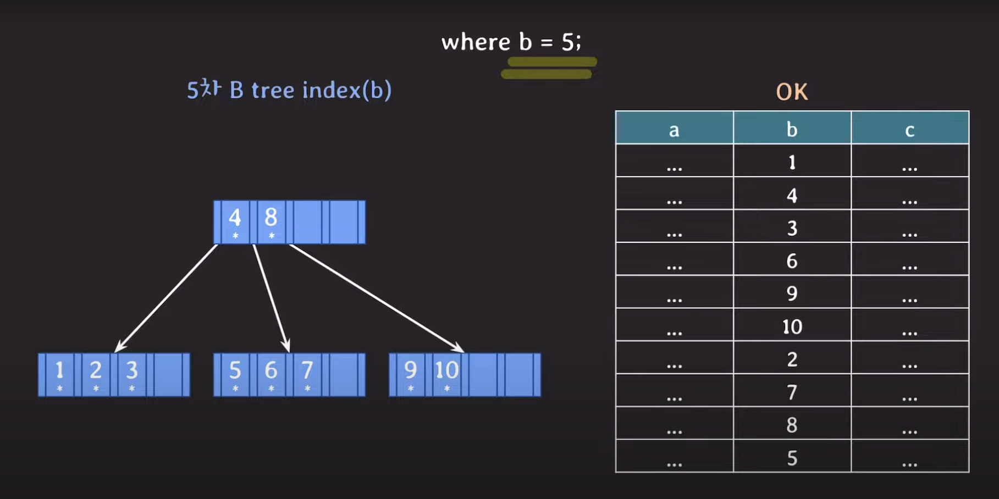

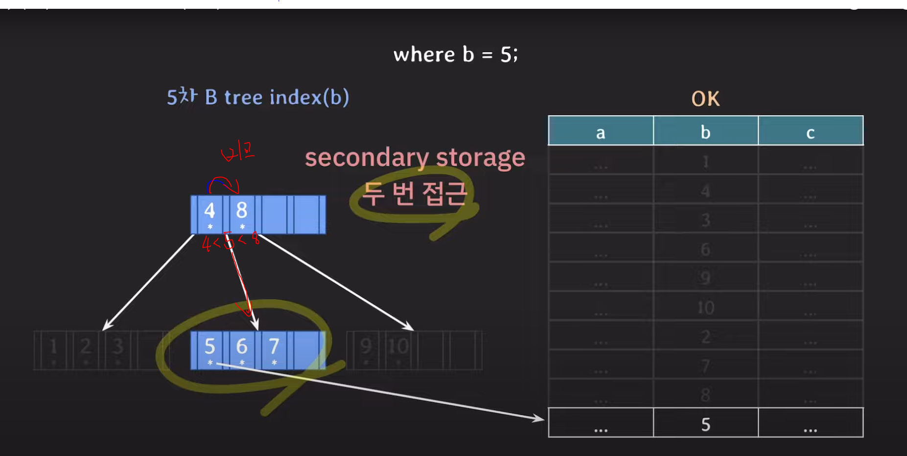

### 성능 적인 측면에서 b tree가 secondary storage에 2번만 접근해서 성능적으로 좋다.

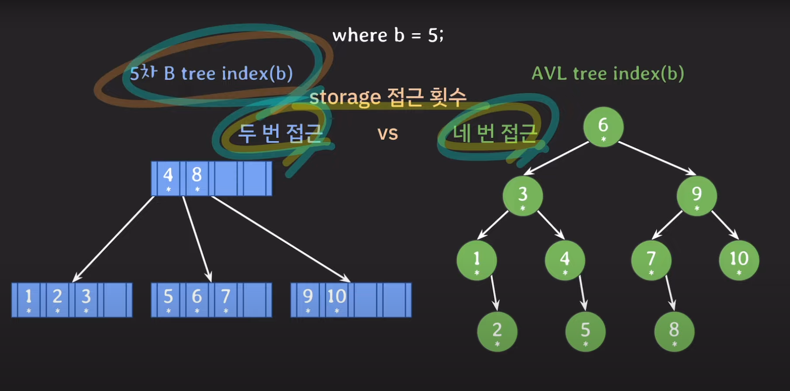

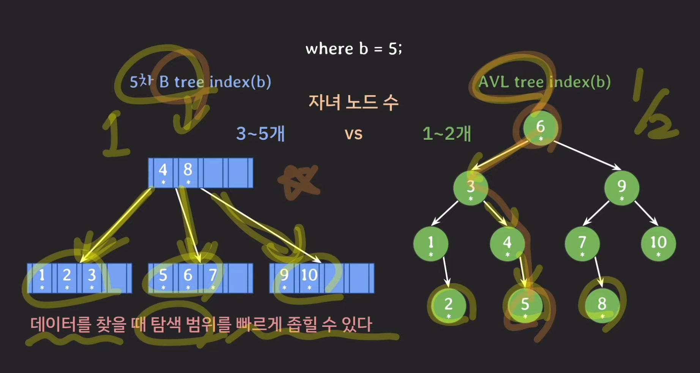

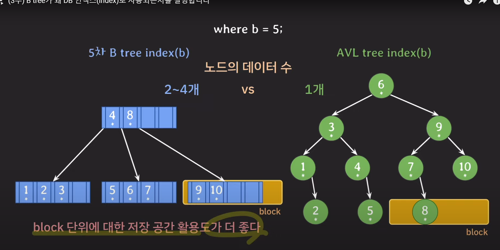

# b tree의 강력함 with 101차 btree

### 101차 b tree가 best case일 때

- 최대 자녀 노드 수 101개

- 최대 key 수 100개 ( 최대 자녀수  - 1 )

- 최소 자녀 노드 수 51 ( ceil(최대 자녀수/2) )

- 최소 key 수	(최소 자녀 수 - 1 )

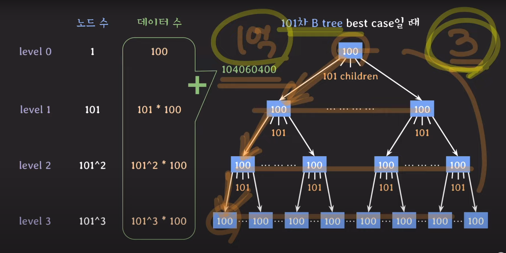

### 101차 b tree가 worst(최악에) case일 때

- 최대 자녀 노드 수 101개

- 최대 key 수 100개 ( 최대 자녀수  - 1 )

- 최소 자녀 노드 수 51 ( ceil(최대 자녀수/2) )

- 최소 key 수	(최소 자녀 수 - 1 )

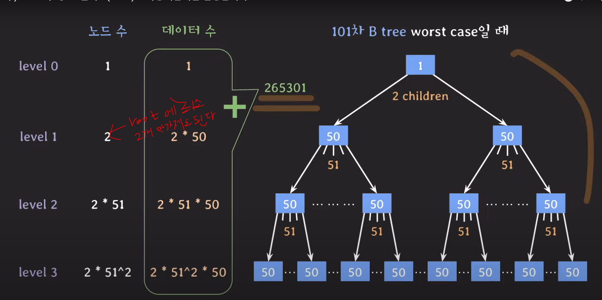

### 101 b tree avg case 일떄

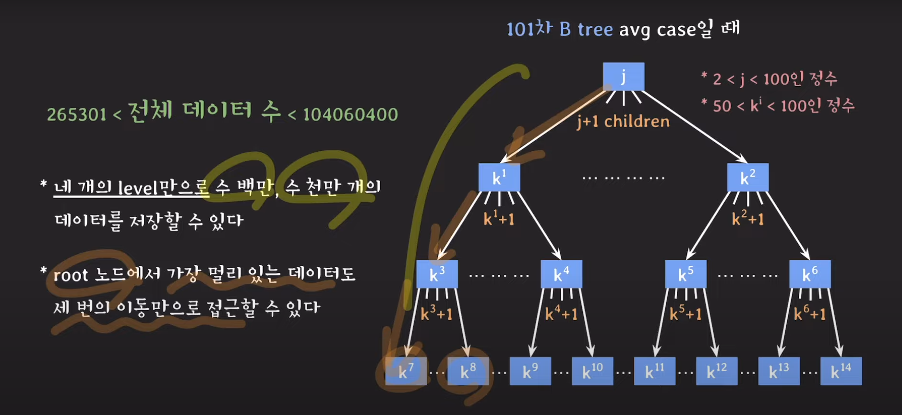

# btree 계열을 db 인덱스로 사용하는이유

### DB는 기본적으로 secondary storage에 저장된다.

### B treen index는 self-balancing bst에 비해 secondary storage에 접근을 적게한다

- ### 이유는 secondary stoeage에 접근시 속도가 매우 느리기 때문에 최소한에 방법으로 접근하는것이 매우 효율 적이기 떄문에 btree방식이 채택이 되었다

### b tree 노드는 block 단위의 저장 공간을 알차게 사용할수있다
- ### 이유는 btree 구조에서 하드웨어에 접근시 block 단위로 데이터를 가져오는데 이떄 btree에 키값은 양옆에 전부 연관된 데이터들이 나열되어 있기때문에 block단위로 데이터를 가져올떄도 연관된 데이터를 메모리에 가져와서 메모리에서 사용하여 다른 연관된 데이터를 가져올떄 메모리에 이미 상주에 있기떄문에 하드웨어 접근을 최소하 할수 있다는 장점이 있다

### 위에 두개에 관계는 상호보안적인 관계를 가진다

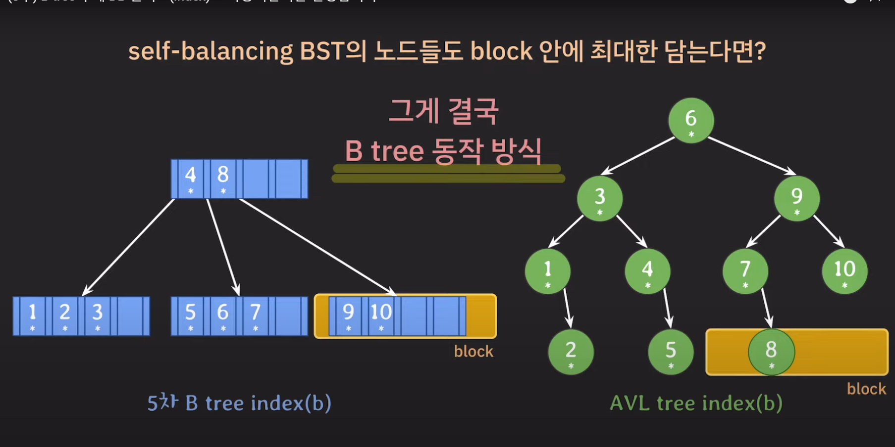

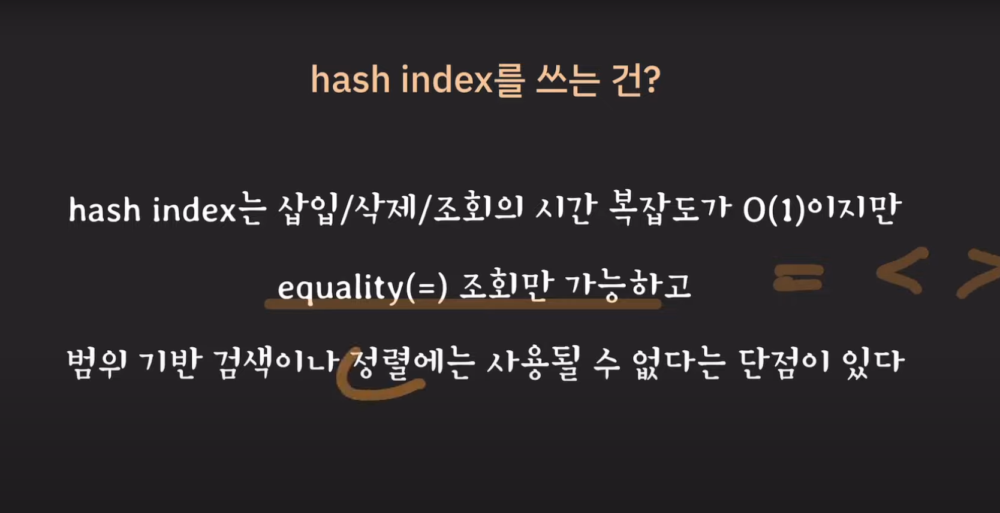