# dbcp 사용하는이유

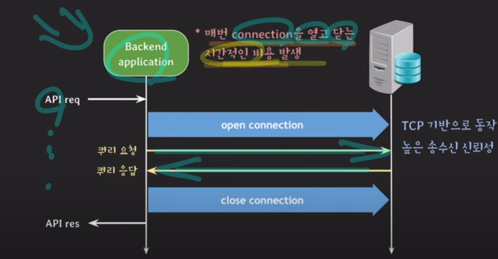

1. 위 사진같이 backend application는 sql서버에 접근할떄 tcp 기반으로 tree way handshake 방식으로 sql 서버와 통신을 한다 이유는 높이 신뢰성이 보장되고 확실한 연결을 지양해야되기 떄문이다.

    ### tree way handshake란
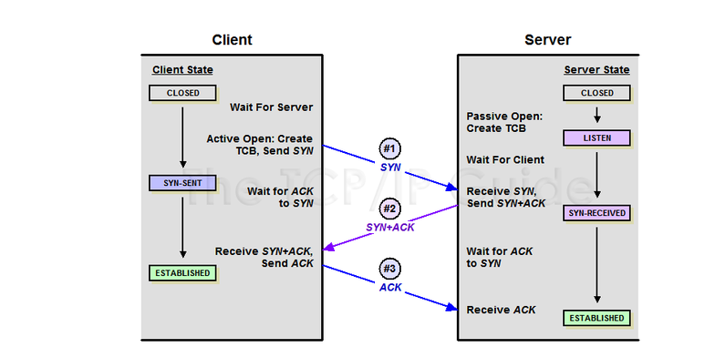

    1. 클라인언트가 서버에 접속을 요청하는 SYN 패킷을 보내고 클라이언트는 SYN패킷에 대한 데이터을 받기위해 기다리는 상태로 변경되고 서버는 클라인언트가 SYN 패킷을 요청이 받기위해 기다리다가 요청이오면 SYN패킷에 대한 정보을 클라이언트에게 던져주고 SYN 패킷을 받았다는 확인을 기다리는 상태로 변경이된다

    2. 클라이언트가 SYN받으면 받으면 다시 서버로부터 받았다고 SYN받았다고 확인에대한 ACK를 서버에 다시 던져주고  서버는 SYN ACK 클라이언트로 받았다는 확인 받았으면 ESTABLISHED 상태로 변경이된다

2. 이런한 클라이언트 통신에  대해서 매번 쿼리 요청과 응답을 많이 하는 경우 서비스에 오버헤드와 CPU부하를 가져올수 있어 서비스 성능에 좋지가 않을수가 있다.

## DBCP(database connection pool) 동작 방식

### 1. conection pool 활용한다

    ### conection pool이란
        클라이언트가 sql서버에 접속상태를 풀이라는 공간에 담아서 연결상태를 유지하는것을 말한다. 장점으로는 클라이언트가 서버로 요청을 보낼때 conection pool에 있는 연결된 자원을 사용하여 클라이언트와 서버에 연결 매번 안하고 기존 연결자원을 사용하여 클라이언트와 서버간에 cpu와 메모리를 효율적으로 사용 할 수 있다.

    
### 2. conection pool 동작 방식

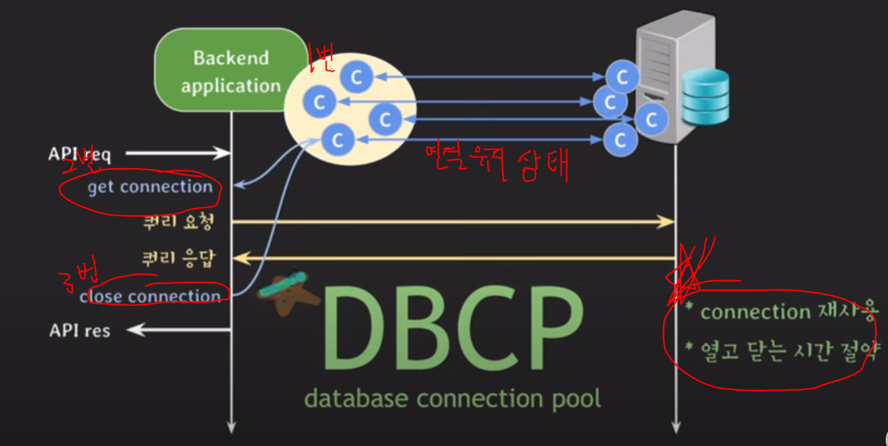

#### 1. 1번 항목에서 클라이언트와 서버와 연결 상태에 connection pool를 미리 n개를 생성한다
#### 2. 2번 클라이언트로 부터 sql요청으로 서버로 부터 보낼떄 일을 안하고 있는데 connection pool 자원을 가져와서 sql문를 실행한다.
#### 3. 3번 sql문를 실행한 값을 데이터를 받고 close connection를 하면 해당 자원을 다시 connection pool(1번 항목)에 다시 돌려준다 

#### 4. 장점으로는 connection를 재사용하여 서버를 열고닫는 시간를 절약 할 수 있다.
 

# connection poll DB서버 주요 설정

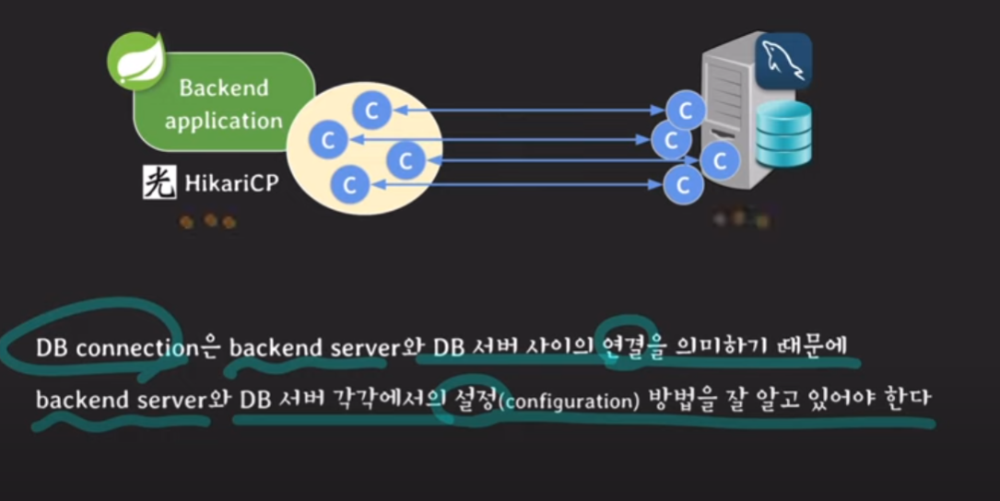

### 1. mysql 설정에 max_connections 설정 및 주의점 
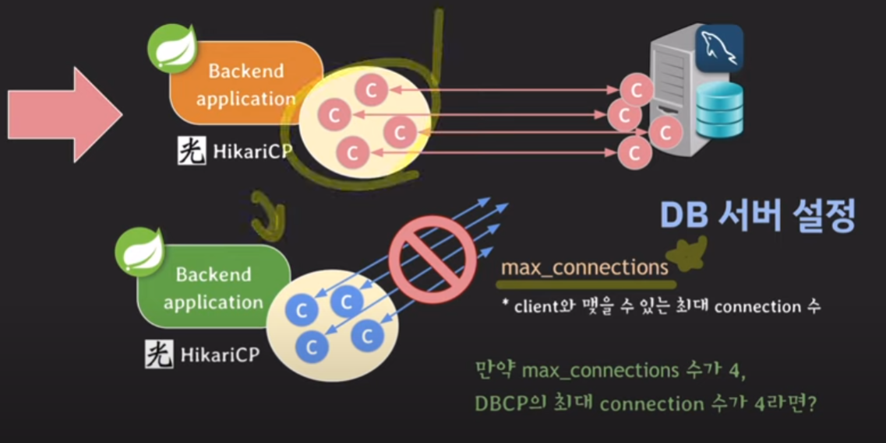
    
    위 그림과 같이 mysql 서버에 max_connections수가 4이고 dbcp의 최대 connection 수가 4인 경우 backend 서버를 요청이 많아서 cpu부하가 높아져서 로드밸런싱를 통해 서버를 한대 더 늘려서 2번쨰 서버도 dbcp 연결 수를 4개로 지정한다고 해도 mysql에 max_connection 수 가 4이기 떄문에 효과를 볼 수가 없다. 효과를 볼려면 max_connection수를 늘려야 한다.

    결론 max_connections를 통해서 mysql 최대 connection값를 잘 조정해야지 dbcp값과 잘 조율 해야지 효과를 볼수가 있다.

### 2. mysql 설정에 wait_timeout 설정

#### 2-1 wait_timeout설정이 중요한 이유
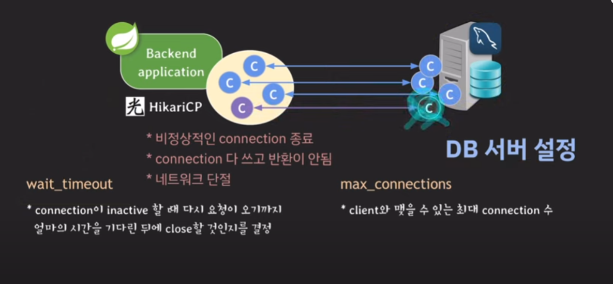

    만약에 connection pool이 비정상적으로 connection이 종료,네트워크단절 다 쓰고 반환이 안되는 경우 connection pool bankend쪽에서는 연결이 끊킨 상태로 체크가되는데 mysql서버단에서는 현재 해당 connection pool과 연결상태로 체크가 되어서 죽은 connection pool들과 mysql 통신를 하고 있어서 이런 상황이 지속되어 mysql에서 connection이 계속 쌓여서 부하가 생길수가 있는데 이때 wait_timeout를 통해서 설정 시간 많큼 요청이 없으면 mysql에서 해당 connection를 끊을수 있게 설정 할 수 있다.

#### 2-1 wait_timeout에서 해당 connection에 타이머 초기화 되는 경우

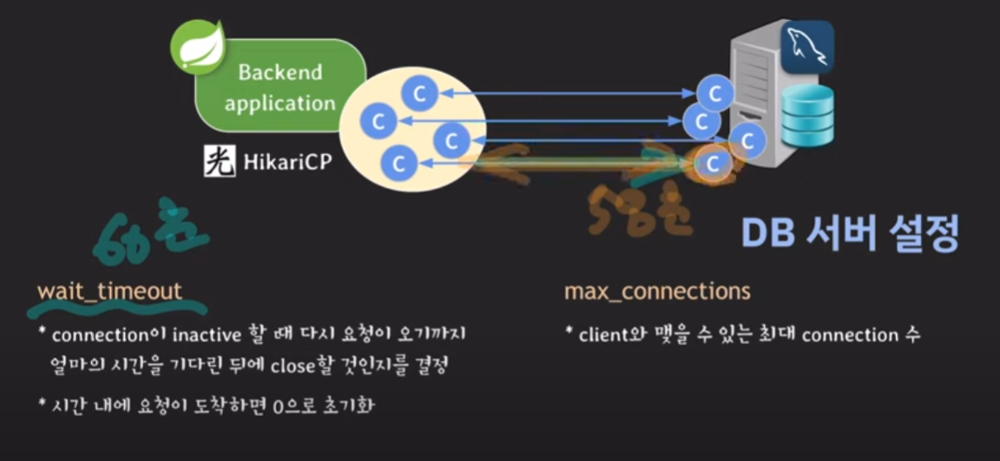

    그림과 같이 wait_timeout이 60초로 설정되어있을떄 connection pool 자원으로 58초떄 해당 connection 자원으로 mysql에 요청이 있을떄 해당 timeout 타이머는 다시 0으로 초기화가 된다.

 

# connection pool DBCP 주요 설정

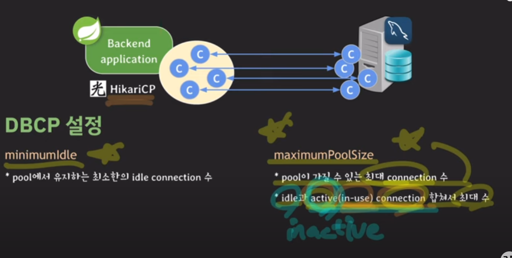

### 1. minimumldle : connection pool 에서 유지하는 최소한의 idle(연결만되고 놀고 있는 상태?) connection 수를 설정

### 2. maximumPoolSize : pool이 가질수 있는 최대 connection 수 idle과 사용중인 connection 수를 합쳐서 최대수를 설정

### minmumidle 과 maxmumpoolSize 관계

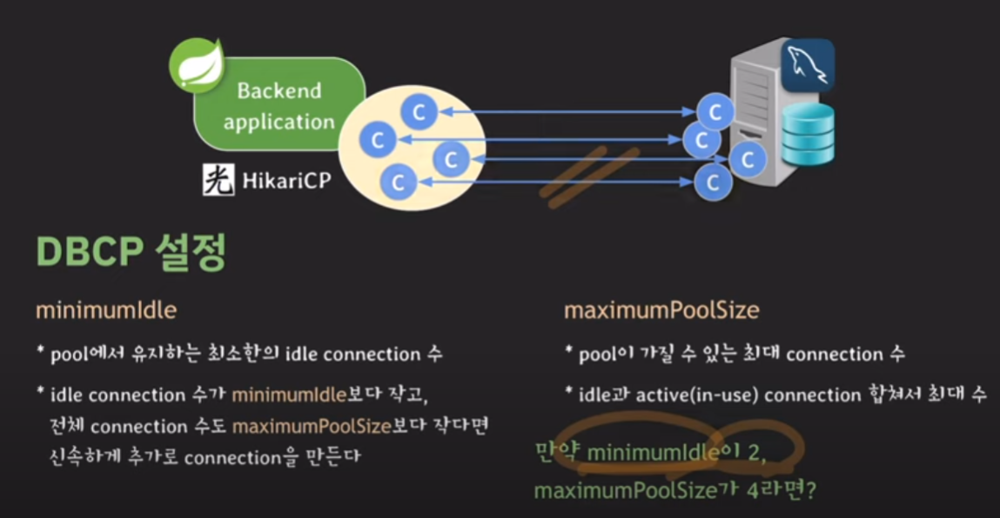

    minmumidle값이 2이고 maxmumpoolSize값이 4이면 만약 connection pool에서 idle인 connection이 1이고 active중인 connection이 3이면 총 4개가 connection중일떄 minmumidle값이 2보다 작기 떄문에 생성을 해야되는거 같지만 maxmumpoolSize값이 4이기 때문에 connection pool를 생성하지 않는다. 위에 설명한 내용같이 idle과 active중인 connection 수를 합쳐서 4이기 떄문에 추가로 connection pool를 생성하지 않는다.

    추가적으로 트래픽이 빠져서 이제 idle인 connection pool 4개가 되면 minmumidle값이 2인 이므로 2개 connection idle값만 유지를하고 나머지 2개에 connection는 해제를 한다.

    설정시 권장사항으로는 minmumidle 과 maxmumpoolSize값를 동일한 값으로 셋팅하는걸 권장한다 이유는 트래픽이 빠져고 다시 올라가면 sql서버와 다시 연결을 해야되므로 시간이 걸리니깐 동일하게 connection pool 갯수를 설정하는것이 권장 사항이라고 한다.

### maxLifetime 설정 및 connection pool 유의사항

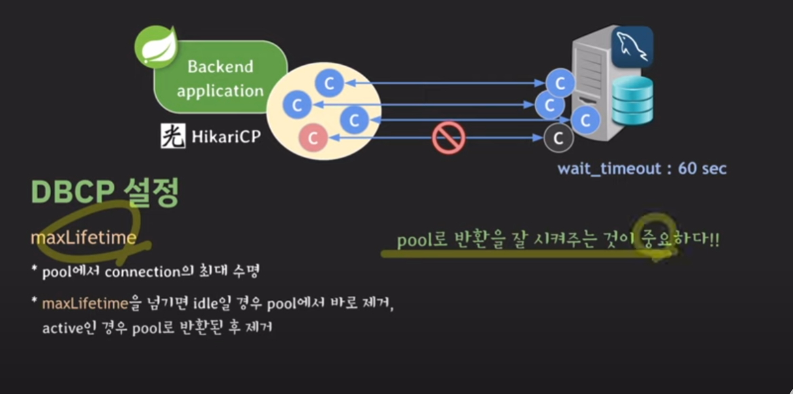

    maxLifetime은 idle인 connection의 timeout를 설정하는값이다 만약 minmumidle값를 4개로 설정한다고하면 해당 idle 한개가 timeout되어 사라지면 다시 sql서버와 연결를 해서 minmumidle 4개를 유지를 한다 

### 1. maxLifetime및 connection pool반환에 유의 사항.

주의 사항으로는 connection pool에서 sql요청 후 할떄 idle상태값은 active로 변경이되는데 sql에요청이 끝나고 반환에 문제가 생기면 해당 connection는 active인 상태 값이여서 계속 해서 연결 상태를 유지를 하는데 이떄 sql서버에서 timeout설정값으로 인하면 해당 connection pool이 mysql과 연결이 끊기면 backend쪽에서는 mysql과 끊기지모르고 다시 해당 connection pool를 sql에서버에서 요청을 보내면 이미 sql서버와 연결이 끊기 상태이기 때문에 Inception에러가 나올수가있다 이런한 경우를 방지하기위해서 connection pool에서 요청이 끝나고 반환를 하는 코드를 확실 점검하고 체크하는것이 중요하다.

### 2. maxLifetime 과 mysql wait_timeout관계에 대한 유의사항

    db의connection time limit보다 몇초 짧게 설정해야된다.

    이유는 maxLifetime가 60이고 wait_timeout값이 60이면 connenction pool에서 60초후 mysql서버에 요청을 보낼떄 mysql서버에 해당 요청을 받는시간이 61초라고 가정하면 이때 wait_timeout이 60초로 설정이 되어있어 연결이 끊길수 가있다 이런한 이유 때문에 maxLifetime에 값을 wait_timeout값 보다 2~3초 적게 설정하는것 좋다.

### 3. connectionTimeout
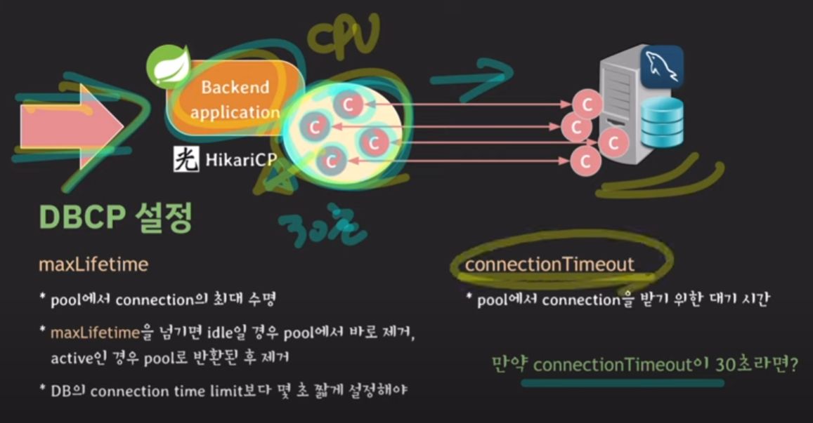

    pool에서 connection을 받기 위한 대기시간 

    connectionTimeout값을 30초로 설정한다고하면 만약에 서버 트래픽이 증가하면 모든 connection pool사용하다고하면 이때 connection pool 30초 가 넘는것들을 강제로 끊어주고 새로운 요청을 해당 connection pool을 통해서 다시 보낼수있게 설정하는 값이다.

파라미터값을 적절하게 설정하는것이 중요하다.

# 적절한 connection 수를 찾기 위한 과정

### 서버 부하 테스트

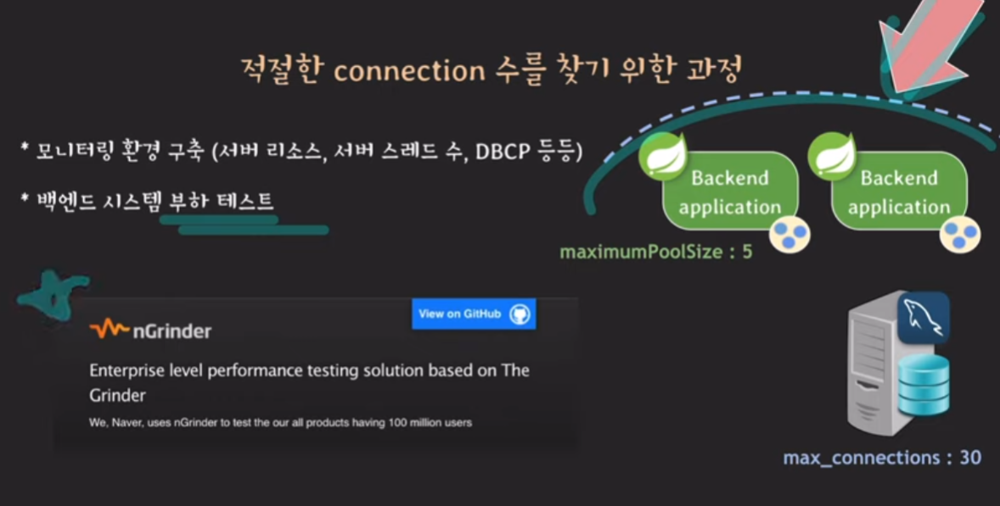

## 서버를 늘려야되는 경우

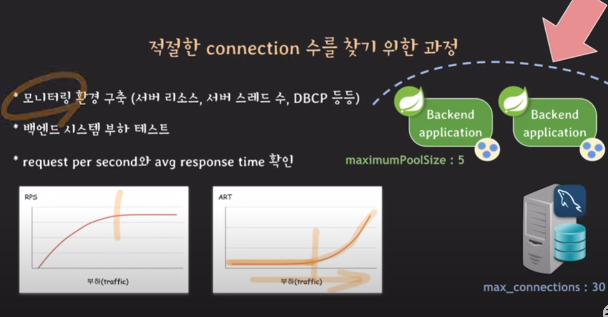

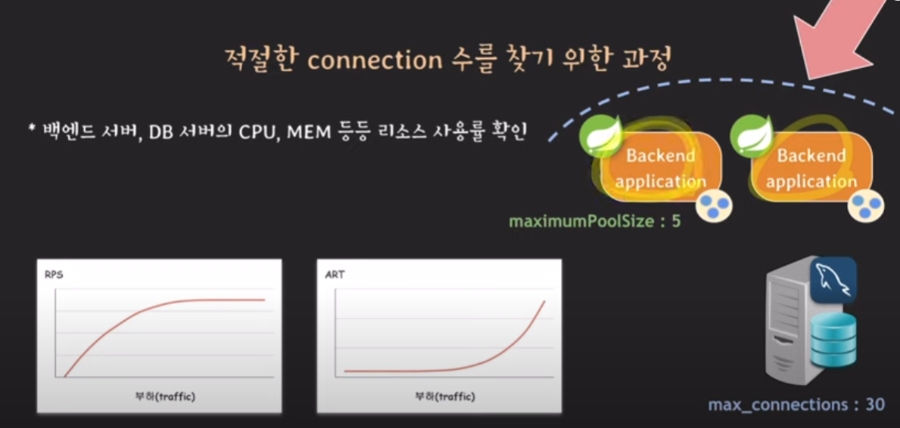

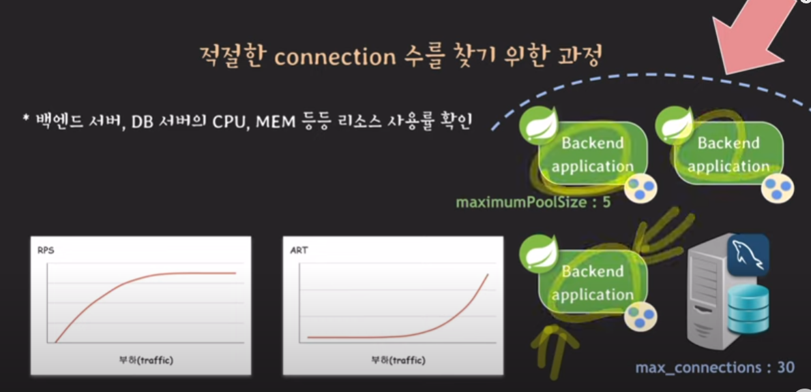

    해당 ngrinder를 통해 부하테스트를 해보고 해당 모니터링 화면처럼 서버쪽에 부하가 생기면 서버에 수를 늘려준다.

### db 서버에 사양을 늘리거나 mysql reader서버를 늘려야되는경우

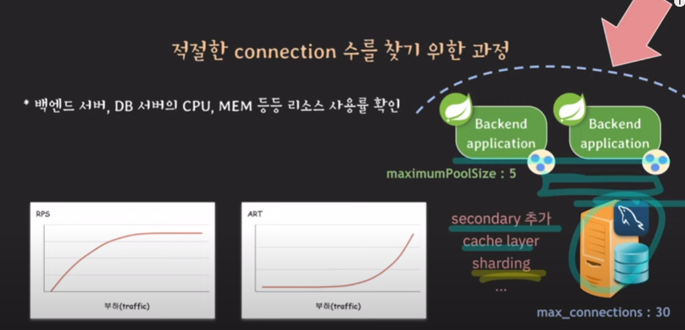

### connection pool값를 체크해야되는경우

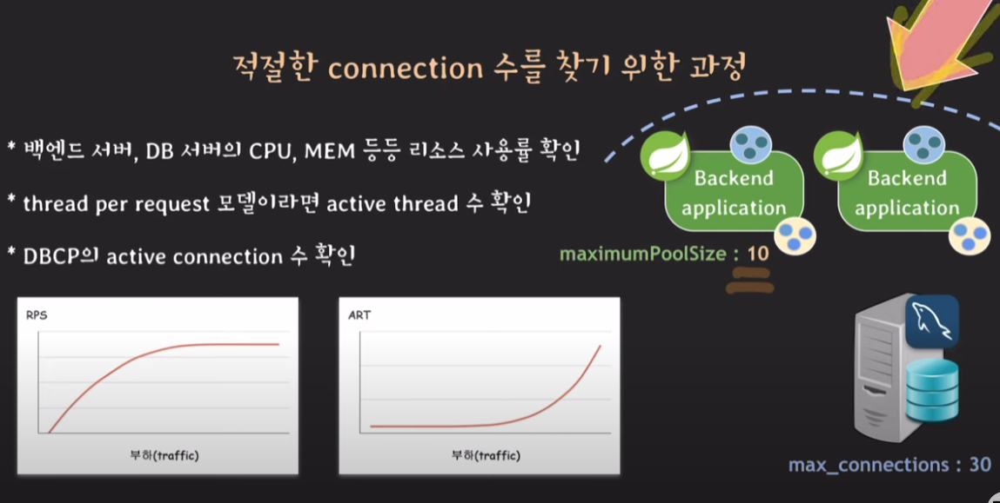

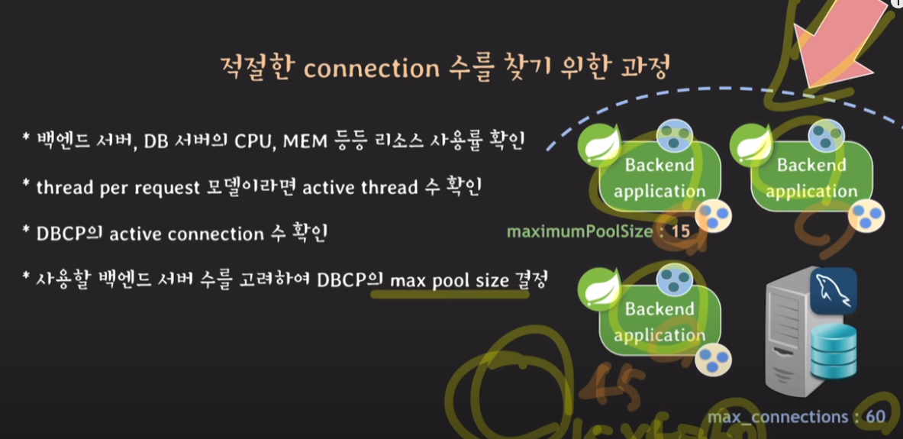

    서버와 db쪽에 문제가 없는경우 connection pool 설정값을 체크해보면서 부하를 낮추도록 한다.

    예 DBCP에서 maxinmumpoolsize 값을 5-> 10 -> 15 이런식으로 조정해보고 db서버에서 max_connections 값도 30 -> 60으로 조정해보면서 테스트를 진행본다.

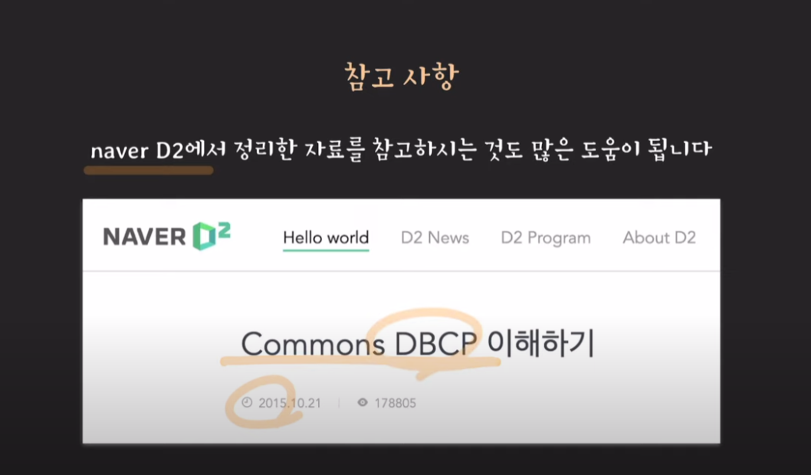

🔸네이버D2 Commons DBCP 이해하기 : https://d2.naver.com/helloworld/5102792

🔸hikariCP github : https://github.com/brettwooldridge/HikariCP

🔸MySQL 설정 페이지 : https://dev.mysql.com/doc/refman/8.0/en/server-system-variables.html

