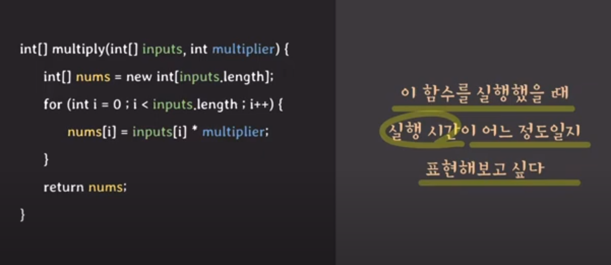

# 시간 복잡도

실행시간 (running time) 이란 함수/알고리즘 수행에 필요한 스텝(step)수

### 실행 시간 계산 방법

  - 여기서 더 정확한 계산은 어렵다
  - N이 작을떄 실행 시간이 의미없다
  - N-> 무한일떄 실행시간이 어떨까?

- 최고 차항만 의미 있다
- 최고차항의 계수는 의미없다

빅 세타 N

- 점근적 분석 임의의 함수가 N -> 무한 일떄 어떤 함수 형태에 접근하는지 분석

### 시간복잡도는 함수의 실행 시간을 표현하는것이면 주로 점근적 분석을 통행 실행시간을 단순하게 표현하며 이 떄 점근적 표기법으로 표현한다.

# 케이스 2 

- 하한선은 점근적 표기법으로 빅오메가원

- 상한선은 빅오n 표기법이있다

보통 이러한 경우 빅오n(상한선)으로 표기한다

